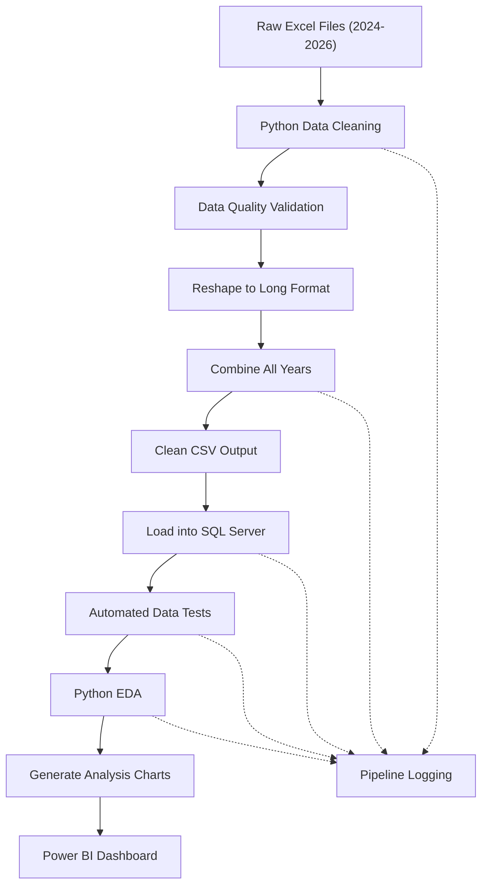
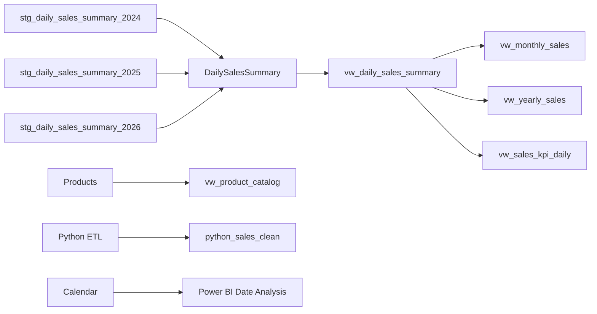
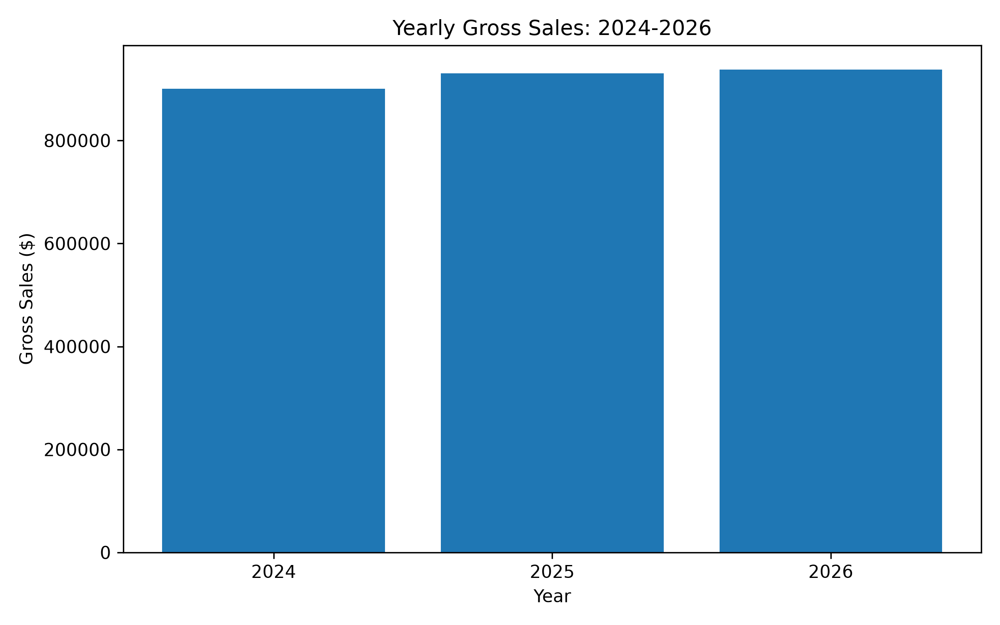
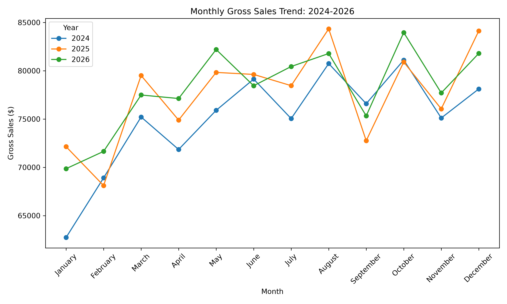
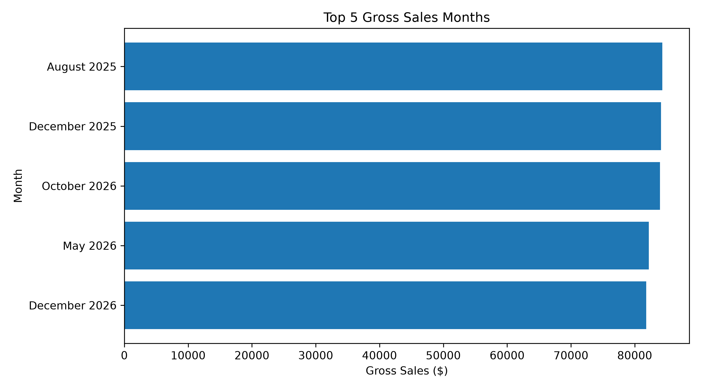
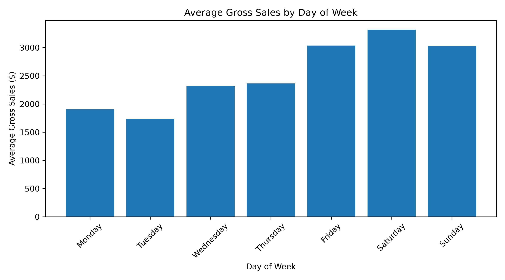

# Retail Analytics Portfolio Project: Python, SQL Server & Power BI (2024–2026)

### Project Highlights

- **End-to-End Pipeline:** Raw Excel → Python ETL → SQL Server → Automated Testing → Python EDA → Power BI
- **Data Coverage:** 2024–2026 retail sales data
- **Validated Records:** 9,864 cleaned sales records
- **Automation:** Full ETL and analysis pipeline runs with one Python command
- **Data Quality:** Automated checks for missing values, duplicates, schema, row count, and date coverage
- **Core Technologies:** Python, pandas, SQL Server, Power BI, Matplotlib, Git, GitHub

---

## Project Overview

This project demonstrates an end-to-end retail data analytics workflow using Python, SQL Server, and Power BI.

The project uses synthetic retail sales and inventory data covering 2024 through 2026. Python is used to extract and clean yearly Excel sales reports, perform automated data-quality checks, reshape the data into an analytics-ready format, combine multiple years, load the cleaned dataset into SQL Server, perform exploratory data analysis, and automatically generate analytical charts.

SQL Server is used for structured data storage, transformations, reporting views, and analytical queries. Power BI is used to build an interactive business dashboard for executive, monthly, and daily sales analysis.

The automated Python pipeline processes all three years and loads **9,864 validated sales records** into SQL Server.

---

## Dashboard Preview


The Power BI report contains three analytical pages:

1. **Executive Overview**
2. **Monthly Performance**
3. **Daily Sales Analysis**

The dashboard is connected to the Python-cleaned SQL Server dataset and uses a shared Calendar table for date filtering.

---

## Tools Used

- Python 3.14
- pandas
- Matplotlib
- openpyxl
- pyodbc
- unittest
- SQL Server
- SQL Server Management Studio (SSMS)
- Power BI Desktop
- Git
- GitHub
- Visual Studio Code

---

## ETL Workflow

The Python pipeline automates the preparation, validation, loading, testing, and analysis of retail sales data before it is consumed by Power BI.



The pipeline performs the following tasks:

- Reads yearly Excel sales reports for 2024, 2025, and 2026
- Extracts the nine required sales metrics
- Removes report headers and non-data rows
- Converts currency values into numeric format
- Converts report dates into standard date values
- Checks for missing values and duplicate records
- Reshapes report-style Excel data into analytics-ready long format
- Creates cleaned yearly CSV files
- Combines all three years into one dataset
- Loads 9,864 validated records into SQL Server
- Runs automated data-quality tests
- Performs Python exploratory data analysis
- Regenerates Python analysis charts automatically
- Writes pipeline execution details and errors to log files
- Supplies cleaned data to the Power BI reporting layer

---

## How to Run the ETL Pipeline

### 1. Create a Python virtual environment

```powershell
python -m venv .venv
```

Activate it:

```powershell
.venv\Scripts\activate
```

### 2. Install required packages

```powershell
python -m pip install -r requirements.txt
```

### 3. Run the complete pipeline

```powershell
python 03_Python_Scripts\run_etl_pipeline.py
```

This single command automatically:

- Processes 2024 sales data
- Processes 2025 sales data
- Processes 2026 sales data
- Performs data-quality validation
- Creates cleaned yearly CSV files
- Combines all yearly data
- Loads the final dataset into SQL Server
- Runs automated tests
- Performs Python EDA
- Regenerates analytical charts
- Writes pipeline execution logs

---

## SQL Server Configuration

The Python scripts use Windows Authentication to connect to SQL Server.

The default configuration is:

```text
Server: localhost\SQLEXPRESS
Database: RetailPortfolio_2024_2026
```

If the SQL Server instance uses a different computer or server name, set environment variables before running the pipeline.

Example:

```powershell
$env:SQL_SERVER="YOUR_COMPUTER_NAME\SQLEXPRESS"
$env:SQL_DATABASE="RetailPortfolio_2024_2026"
```

Then run:

```powershell
python 03_Python_Scripts\run_etl_pipeline.py
```

The SQL connection configuration can therefore be changed without modifying the Python source code.

---

## Project Structure

```text
RetailPortfolio_2024_2026/
│
├── 01_Raw_Data/
│   ├── Sales/
│   ├── Inventory/
│   └── Other_Reports/
│
├── 02_Clean_Data/
│   ├── sales_2024_clean.csv
│   ├── sales_2025_clean.csv
│   ├── sales_2026_clean.csv
│   └── sales_2024_2026_combined.csv
│
├── 03_Python_Scripts/
│   ├── data_quality_check.py
│   ├── combine_sales_data.py
│   ├── load_sales_to_sql.py
│   ├── test_sql_connection.py
│   ├── sales_eda_analysis.py
│   ├── test_sales_data.py
│   └── run_etl_pipeline.py
│
├── 03_SQL_Scripts/
│   ├── 01_create_sales_tables_and_views.sql
│   ├── 02_create_products_and_views.sql
│   └── 03_create_calendar_table.sql
│
├── 04_PowerBI/
│   └── RetailPortfolio_2024_2026_Dashboard.pbix
│
├── 05_Screenshots/
│   ├── 06_powerbi_executive_overview_2024_2026.png
│   ├── 09_python_yearly_gross_sales.png
│   ├── 10_python_monthly_gross_sales_trend.png
│   ├── 11_python_top_5_sales_months.png
│   └── 12_python_sales_by_day_of_week.png
│
├── 06_Logs/
│   └── .gitkeep
│
├── requirements.txt
├── .gitignore
└── README.md
```

---

## Key Features

- End-to-end retail analytics workflow using Python, SQL Server, and Power BI
- Automated processing of 2024, 2025, and 2026 sales workbooks
- Python-based data cleaning and transformation with pandas
- Automated missing-value and duplicate detection
- Currency and date standardization
- Transformation from report-style Excel data into long format
- Automated combination of multiple yearly datasets
- SQL Server loading with pyodbc
- Safe SQL table refresh process to prevent duplicate inserts
- Automated data-quality tests
- Pipeline execution logging
- Python exploratory data analysis
- Automated analytical chart generation
- One-command master pipeline
- Interactive Power BI reporting
- Git and GitHub version control

---

## Data Quality Results

The final combined dataset contains:

- **9,864 validated sales records**
- **0 missing values**
- **0 duplicate Metric + SalesDate records**
- Complete date coverage from **January 1, 2024 through December 31, 2026**
- **9 core sales metrics** for each reporting period

The nine sales metrics include:

- Gross sales
- Refunds
- Net sales
- Overpayments
- Taxes expected
- Taxes collected
- Tips
- Amount collected
- Unpaid balance

---

## Automated Testing and Logging

The Python pipeline includes automated validation and execution logging to make the workflow more reliable and production-like.

### Automated Data Tests

The test suite validates:

- Expected combined row count: **9,864**
- No missing values
- No duplicate `Metric + SalesDate` records
- Required columns are present
- Date range is exactly **2024-01-01 through 2026-12-31**

The tests run automatically as part of the master ETL pipeline.

The test file is:

```text
03_Python_Scripts/test_sales_data.py
```

Tests can also be executed independently:

```powershell
python 03_Python_Scripts\test_sales_data.py
```

A successful test run returns:

```text
.....
----------------------------------------------------------------------
Ran 5 tests
OK
```

### Pipeline Logging

Each pipeline run writes execution details to:

```text
06_Logs/etl_pipeline.log
```

The log records:

- Pipeline start
- 2024 processing completion
- 2025 processing completion
- 2026 processing completion
- Data combination completion
- SQL Server load completion
- Automated test completion
- Python EDA completion
- Pipeline completion
- Errors and failures

Generated `.log` files are excluded from GitHub through `.gitignore`.

---

## Data Model

The SQL Server layer organizes the cleaned retail data into structured tables and views designed for reporting and Power BI analysis.



The `python_sales_clean` table contains the validated long-format dataset generated by the Python ETL pipeline.

The Power BI model connects:

```text
Calendar[CalendarDate]
        1
        |
        *
python_sales_clean[SalesDate]
```

This relationship allows Year, Month, and Date slicers to filter the Python-backed sales measures.

---

## Power BI Reporting

The Power BI report contains three pages.

### 1. Executive Overview

Provides high-level business performance metrics and trends, including:

- Gross Sales
- Net Sales
- Refunds
- Amount Collected
- Net Sales by Year
- Monthly Net Sales Trend
- Net Sales by Day of Week

### 2. Monthly Performance

Provides month-level performance analysis, including:

- Gross Sales
- Net Sales
- Refunds
- Tax Collected
- Monthly Gross Sales trends
- Year and Month filtering

### 3. Daily Sales Analysis

Provides detailed daily sales analysis, including:

- Reported Net Sales
- Net Sales After Refunds
- Gross Sales
- Refunds
- Tax Collected
- Daily Gross Sales Trend
- Year and Month filtering

The main Power BI measures are backed by data loaded through the Python pipeline.

---

## Python Exploratory Data Analysis

Python is also used for exploratory data analysis and business insight generation on the cleaned 2024–2026 retail sales dataset.

Key analyses include:

- Yearly Gross Sales comparison
- Year-over-Year Gross Sales growth
- Monthly Gross Sales trends
- Top 5 Gross Sales months
- Average Gross Sales by day of week

The analysis script is:

```text
03_Python_Scripts/sales_eda_analysis.py
```

---

### Yearly Gross Sales



Gross Sales totals:

| Year | Gross Sales |
|---|---:|
| 2024 | $900,437.31 |
| 2025 | $930,735.11 |
| 2026 | $937,772.19 |

Year-over-Year growth:

- **2025:** 3.36%
- **2026:** 0.76%

---

### Monthly Gross Sales Trend



The monthly analysis makes it possible to compare seasonality and sales performance across all three years.

---

### Top 5 Gross Sales Months



The five strongest monthly Gross Sales periods were:

| Rank | Period | Gross Sales |
|---|---|---:|
| 1 | August 2025 | $84,339.32 |
| 2 | December 2025 | $84,126.02 |
| 3 | October 2026 | $83,958.84 |
| 4 | May 2026 | $82,199.63 |
| 5 | December 2026 | $81,794.41 |

---

### Average Gross Sales by Day of Week



The analysis identified differences in sales performance by weekday.

- **Saturday** had the highest average Gross Sales at approximately **$3,317**
- **Tuesday** had the lowest average Gross Sales at approximately **$1,731**

---

## Key Python Insights

- Gross Sales increased from **$900,437.31 in 2024** to **$930,735.11 in 2025** and **$937,772.19 in 2026**
- Year-over-Year Gross Sales growth was approximately **3.36% in 2025**
- Growth continued in 2026 but slowed to approximately **0.76%**
- **August 2025** was the strongest sales month in the three-year dataset
- December performed strongly in both 2025 and 2026
- **Saturday** produced the highest average Gross Sales
- **Tuesday** produced the lowest average Gross Sales
- Multi-year analysis helps identify both long-term growth and seasonal sales patterns

---

## Business Questions Answered

This project supports analysis of key retail business questions, including:

- How do sales change from 2024 through 2026?
- Which months generate the highest and lowest sales?
- Which days of the week perform best?
- How do Gross Sales compare with Net Sales?
- How much revenue is lost through refunds?
- How much tax is collected?
- How does sales performance change over time?
- Are there recurring seasonal patterns?
- Is year-over-year growth accelerating or slowing?

---

## Key Insights

The project highlights several useful retail performance patterns:

- Sales increased across the three-year reporting period
- Growth between 2025 and 2026 was slower than growth between 2024 and 2025
- Monthly sales performance varies significantly throughout the year
- Certain months consistently produce stronger revenue
- Weekend sales, particularly Saturday, outperform several weekdays
- Refund-adjusted Net Sales provide a more conservative view of realized revenue
- Python, SQL Server, and Power BI provide complementary layers for data preparation, validation, analysis, and reporting

---

## What This Project Demonstrates

This project demonstrates practical experience with:

- Python data cleaning
- pandas data transformation
- ETL pipeline development
- Data-quality validation
- Automated testing
- Application logging
- SQL Server integration
- SQL views and analytical queries
- Data modeling
- Power BI dashboard development
- DAX measures
- Time-series analysis
- Exploratory data analysis
- Matplotlib visualization
- Multi-year dataset analysis
- Git version control
- GitHub project documentation
- Reproducible analytics workflows

---

## Future Enhancements

Potential improvements to make the pipeline more production-ready include:

- Implement incremental loading instead of full-table refreshes
- Add additional unit and integration tests
- Add SQL Server validation tests
- Add pipeline run IDs and execution-duration tracking
- Add structured JSON logging
- Schedule the ETL pipeline automatically
- Add alerting when a pipeline test fails
- Add additional Python visualizations and statistical analysis
- Add forecasting or predictive analytics
- Deploy the pipeline using Azure or AWS
- Add continuous integration with GitHub Actions
- Publish the Power BI report through Power BI Service

---

## Portfolio Purpose

This project was designed as a portfolio demonstration of an end-to-end analytics workflow rather than a single dashboard.

It shows how raw business data can move through:

```text
Raw Data
   ↓
Python ETL
   ↓
Data Quality Validation
   ↓
SQL Server
   ↓
Automated Testing
   ↓
Python Analysis
   ↓
Power BI
   ↓
Business Insights
```

The goal is to demonstrate practical skills relevant to roles such as:

- Data Analyst
- Business Intelligence Analyst
- Junior Data Engineer
- Reporting Analyst
- SQL Analyst
- Power BI Developer

---

## Repository

This repository contains the source data, Python scripts, SQL scripts, Power BI dashboard, generated analysis charts, and documentation required to reproduce the project.