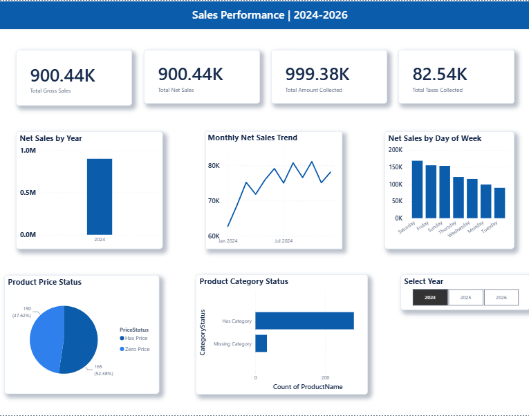
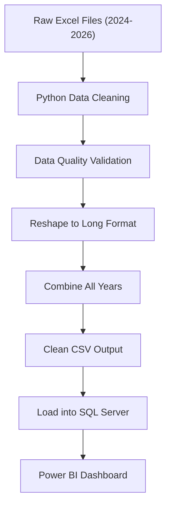

# Retail Analytics Portfolio Project: Python, SQL Server & Power BI (2024–2026)

### Project Highlights

- **End-to-End Pipeline:** Raw Excel → Python ETL → SQL Server → Power BI
- **Data Coverage:** 2024–2026 retail sales data
- **Validated Records:** 9,864 cleaned sales records
- **Automation:** Full ETL pipeline runs with one Python command
- **Core Technologies:** Python, pandas, SQL Server, Power BI, Git

## Project Overview

This project demonstrates an end-to-end retail data analytics workflow using Python, SQL Server, and Power BI.

The project uses fake retail sales and inventory data from 2024 through 2026. Python is used to extract and clean yearly Excel sales reports, perform automated data-quality checks, reshape the data into an analytics-ready format, combine multiple years, and load the cleaned dataset into SQL Server. SQL Server is used for data storage, transformation, reporting views, and analytical queries, while Power BI is used to build an interactive business dashboard.

The Python ETL pipeline can process all three years and load 9,864 validated sales records into SQL Server with a single command.

## Dashboard Preview




## Tools Used

- Python 3.14
- pandas
- openpyxl
- pyodbc
- SQL Server
- SQL Server Management Studio (SSMS)
- Power BI
- Git
- GitHub

## ETL Workflow

The Python ETL pipeline automates the preparation of retail sales data before it is loaded into SQL Server.



## Database

Database name:

```sql
RetailPortfolio_2024_2026
```

SQL Server connection:

```text
localhost\SQLEXPRESS
```

## How to Run the ETL Pipeline

1. Create and activate a Python virtual environment.

```powershell
python -m venv .venv
.venv\Scripts\activate

## SQL Server Configuration

The Python scripts use Windows Authentication to connect to SQL Server.

By default, the scripts use:

```text
Server: localhost\SQLEXPRESS
Database: RetailPortfolio_2024_2026
## Project Structure

```text
RetailPortfolio_2024_2026/
│
├── 01_Raw_Data/
│   ├── Sales/
│   ├── Inventory/
│   └── Other_Reports/
│
├── 02_Clean_Data/
│   ├── sales_2024_clean.csv
│   ├── sales_2025_clean.csv
│   ├── sales_2026_clean.csv
│   └── sales_2024_2026_combined.csv
│
├── 03_Python_Scripts/
│   ├── data_quality_check.py
│   ├── combine_sales_data.py
│   ├── load_sales_to_sql.py
│   ├── test_sql_connection.py
│   └── run_etl_pipeline.py
│
├── 03_SQL_Scripts/
├── 04_PowerBI/
├── 05_Screenshots/
├── requirements.txt
├── .gitignore
└── README.md

## Key Features

- End-to-end retail analytics workflow using Python, SQL Server, and Power BI
- Automated processing of 2024, 2025, and 2026 sales workbooks
- Data cleaning and validation with pandas
- Detection of missing values and duplicate records
- Currency and date standardization
- Transformation from report-style Excel data into analytics-ready long format
- Automated combination of multiple yearly datasets
- SQL Server loading with pyodbc
- Safe table refresh process to prevent duplicate inserts
- One-command master ETL pipeline
- Power BI dashboard for business reporting and trend analysis

## Data Quality Results

The final combined dataset contains:

- 9,864 validated sales records
- 0 missing values
- 0 duplicate Metric + SalesDate records
- Complete date coverage from January 1, 2024 through December 31, 2026
- 9 core sales metrics processed for each daily reporting period

## What This Project Demonstrates

This project demonstrates practical experience with:

- Python data cleaning and transformation
- ETL pipeline design and automation
- Data quality validation
- SQL Server database integration
- Working with multi-year datasets
- Preparing analytics-ready data for reporting
- Power BI dashboard development
- Git and GitHub version control
- Organizing a real-world analytics project for reproducibility and portfolio presentation
## Project Workflow

1. Created a local SQL Server database.
2. Organized raw and cleaned files into project folders.
3. Exported Excel workbook sheets into SQL-ready CSV files.
4. Imported 2024, 2025, and 2026 sales data into staging tables.
5. Combined yearly sales staging tables into one clean sales table.
6. Imported 2024, 2025, and 2026 product/inventory files into staging tables.
7. Combined yearly product staging tables into one clean product table.
8. Created SQL views for sales reporting and product data-quality reporting.
9. Created a Calendar table for Power BI date filtering.
10. Connected Power BI Desktop to SQL Server.
11. Built a dashboard with sales KPIs, trends, and product data-quality visuals.

## Main SQL Objects

### Staging Tables

```sql
stg_daily_sales_summary_2024
stg_daily_sales_summary_2025
stg_daily_sales_summary_2026

stg_products_2024
stg_products_2025
stg_products_2026
```

### Clean Tables

```sql
DailySalesSummary
Products
Calendar
```

### Reporting Views

```sql
vw_daily_sales_summary
vw_monthly_sales
vw_yearly_sales
vw_sales_kpi_daily
vw_product_catalog
```

## Dashboard Features

The Power BI dashboard includes:

* Total Gross Sales card
* Total Net Sales card
* Total Amount Collected card
* Total Taxes Collected card
* Net Sales by Year chart
* Monthly Net Sales Trend chart
* Net Sales by Day of Week chart
* Product Price Status chart
* Product Category Status chart
* Year slicer

## Skills Demonstrated

* SQL Server database setup
* CSV import into SQL Server
* Staging table workflow
* SQL data cleaning
* Combining multiple years of data with `UNION ALL`
* SQL views for reporting
* Data-quality checks
* Calendar/date table creation
* Power BI data modeling
* Power BI dashboard design
* Portfolio project organization

## Data Note

This project uses fake/sample retail data for learning and portfolio purposes.
